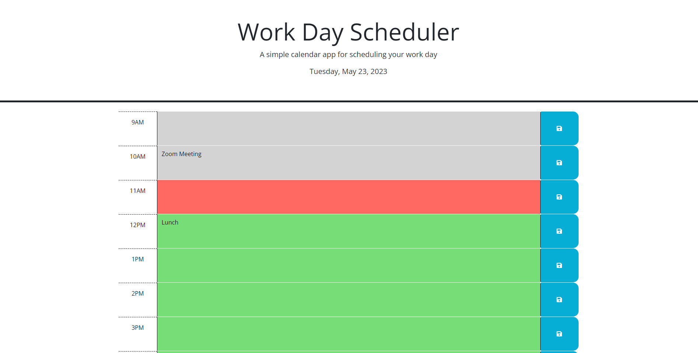

# Work Day Scheduler 

# Link to Deployed Website

https://b-pharmd.github.io/Work-Day-Scheduler/

## Description

This is a work day scheduler to help organize the hours in the day and save tasks for each hour.  The HTML elements in the schedule are created dynamically in the script.js file. When the save button is clicked for each hour, the text in that hour will be saved to the local storage. It will continue to display even when the page is refreshed. The hour blocks are color coded based on the time of day. The current hour displays red, past hours dispay gray, and future hours dispay green. The current date and time dispay at the top of the page.

## Usage

## Credits

I used the following/tutorials:

https://marketsplash.com/tutorials/jquery/jquery-create-element/
https://api.jquery.com/attr/
https://learn.jquery.com/events/event-basics/
https://www.w3schools.com/jquery/jquery_dom_add.asp
https://www.w3schools.com/jsref/prop_win_localstorage.asp
https://www.w3schools.com/jquery/event_ready.asp
http://learn.jquery.com/using-jquery-core/document-ready/
https://www.tutorialsteacher.com/javascript/immediately-invoked-function-expression-iife
https://softauthor.com/javascript-for-loop-click-event-issues-solutions/

Help from instructor/Ta's:
The instructor and TA's helped me by moving the block of javascript code located in lines 58-67. It was up higher and not executing properly.